You know what people say about you, Rakesh, chirag and navidthas are doing  wonderfull job !!

# 📦 Inventory Management System (Laravel API + Frontend Addon)

A role-based inventory management system built using **Laravel 12**, featuring API authentication, CSV export, and an extendable UI dashboard.

## 🚀 Features

- 🔐 API Authentication (Login, Register)
- 👥 Role-based Access (Manager & Employee)
- 📦 Product Management (CRUD)
- 📤 Export Products as CSV
- 👤 User List UI (for managers)
- 🧑 Profile Management UI
- 📊 Dashboard Overview (product stats, user roles)

---

## 🖼️ Screenshots

### 🔐 Home Page


### 👥 User Management
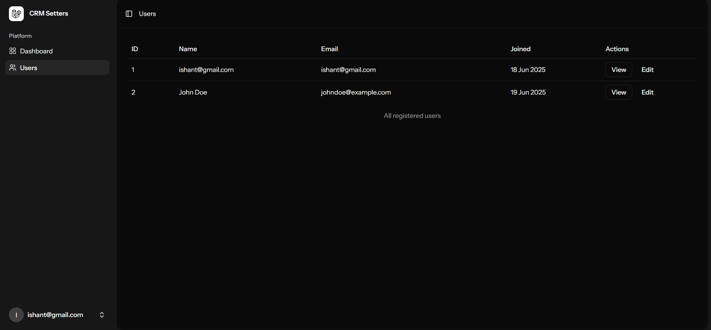

### 📈 Profile Page
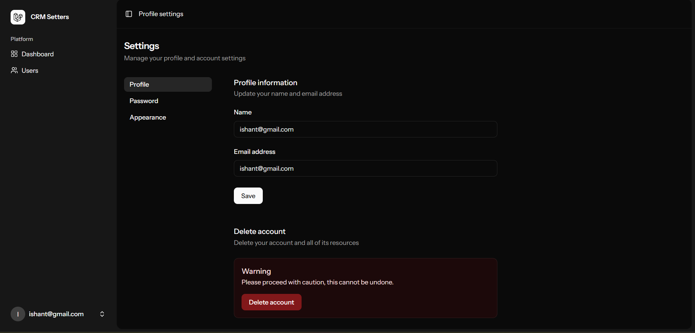


### 📈 Setting Page
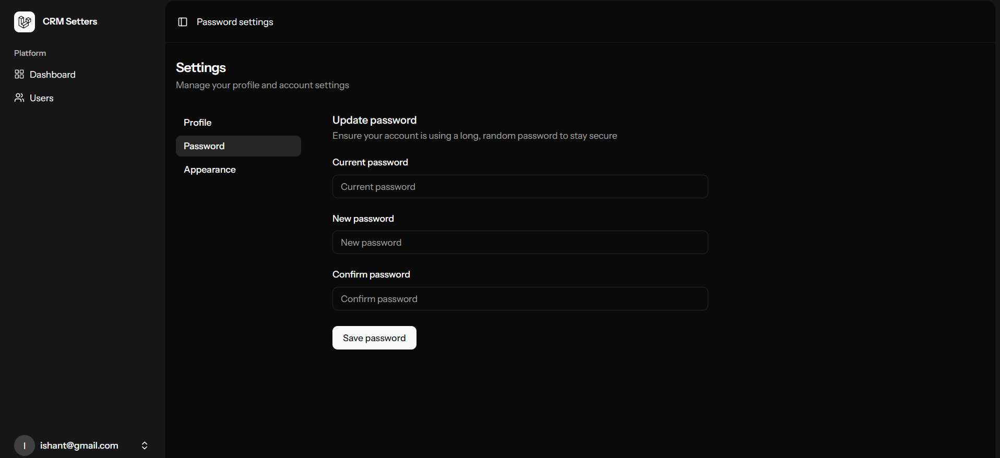


### 📈 Password Rest Page
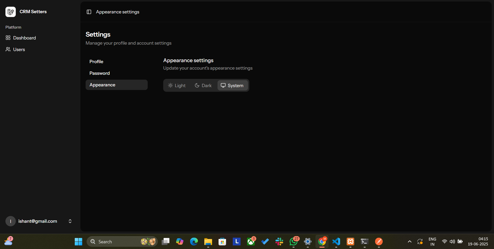

---

## 📮 Postman API Collection Output

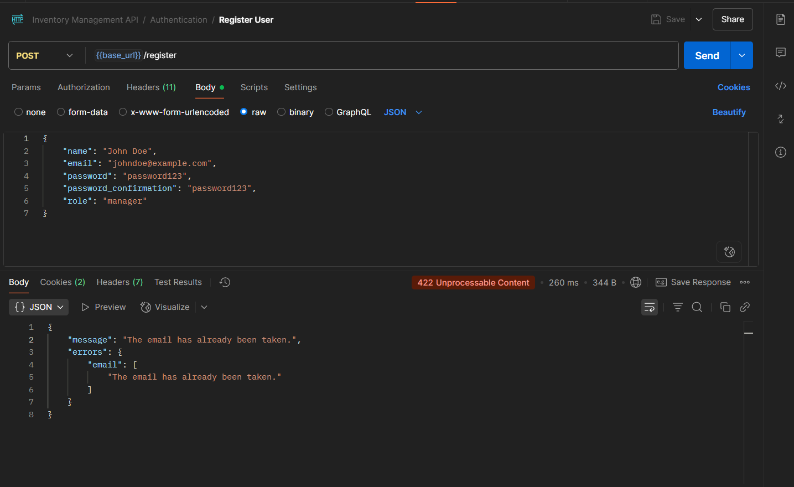
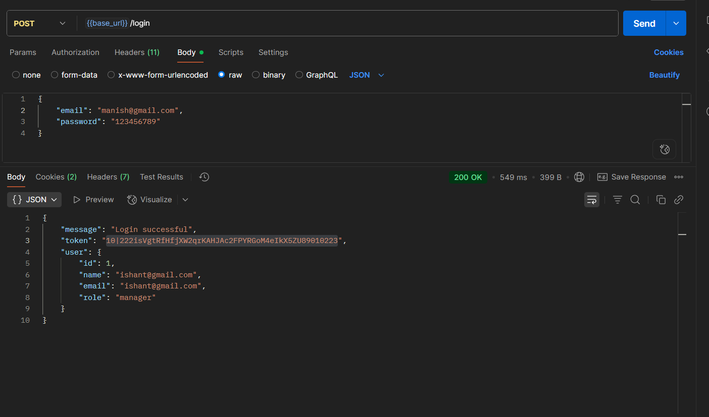
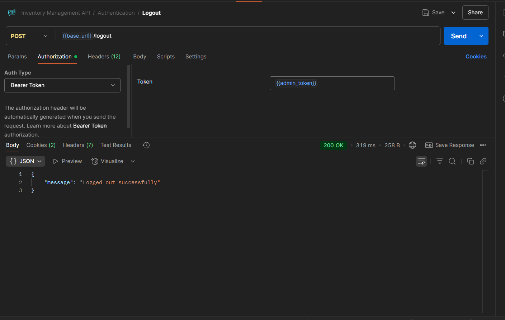
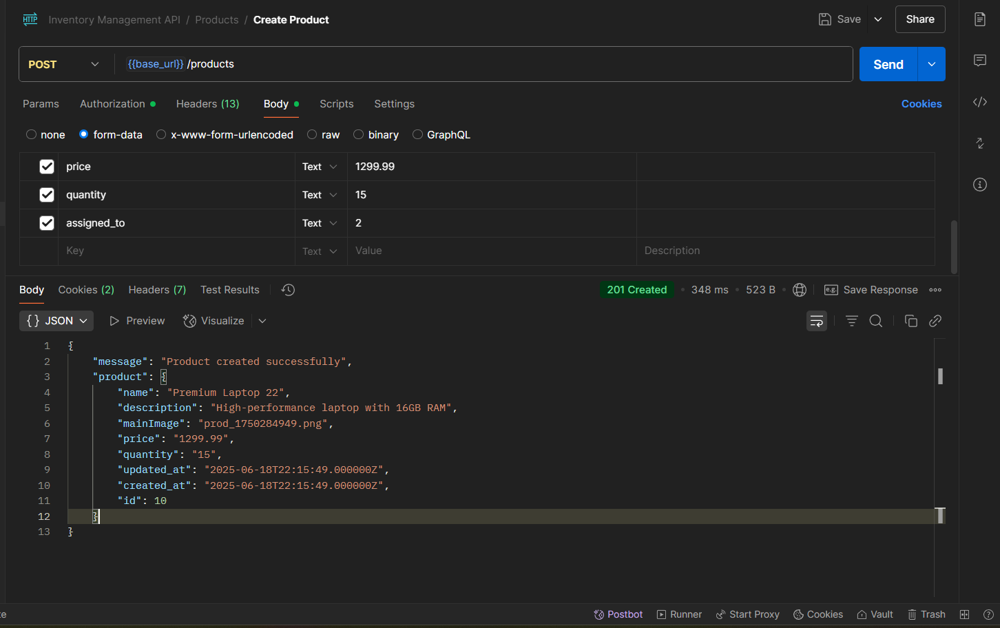
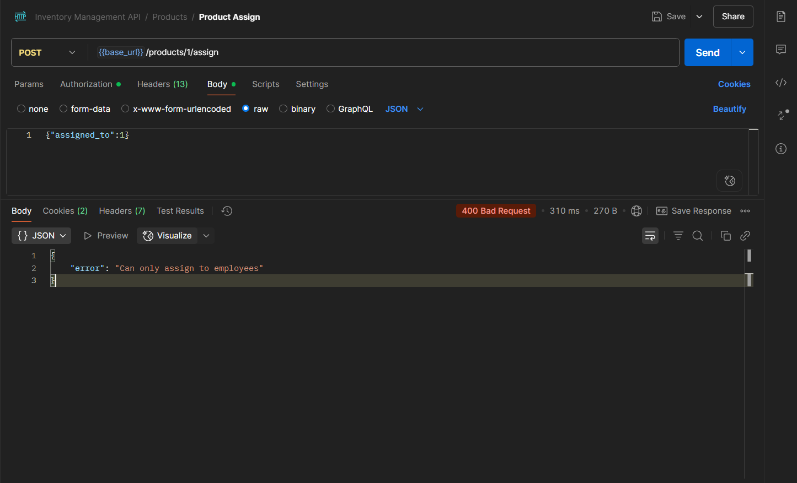
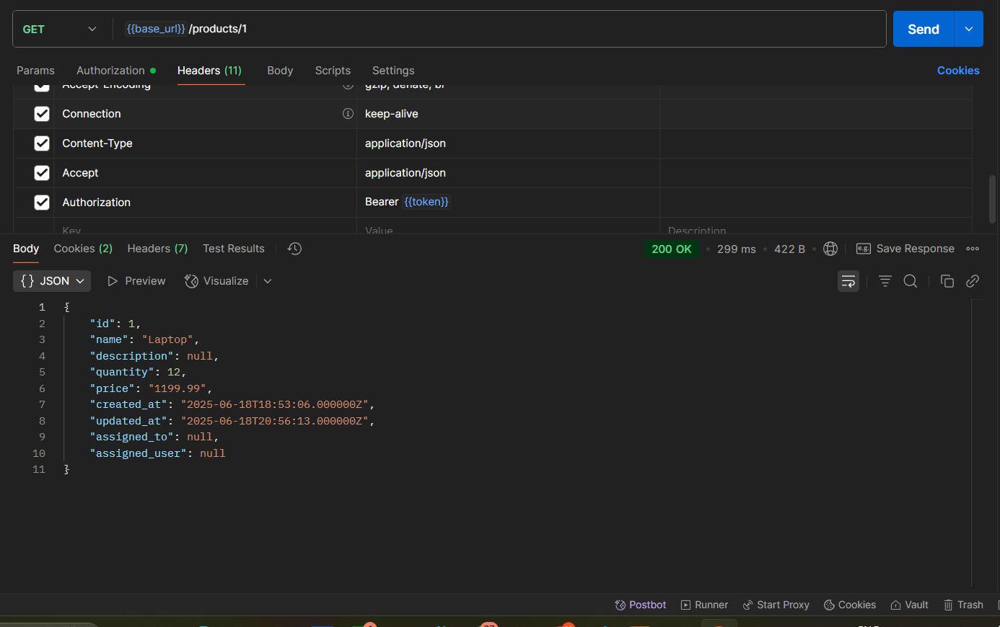
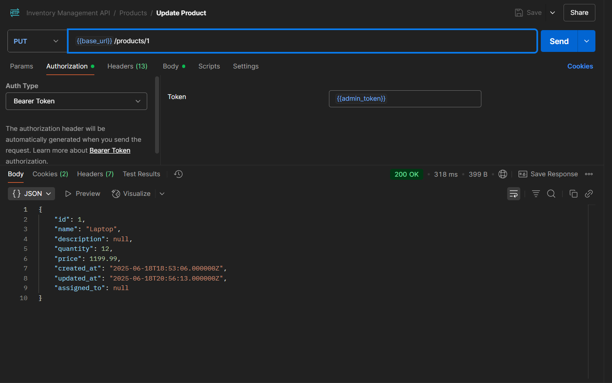
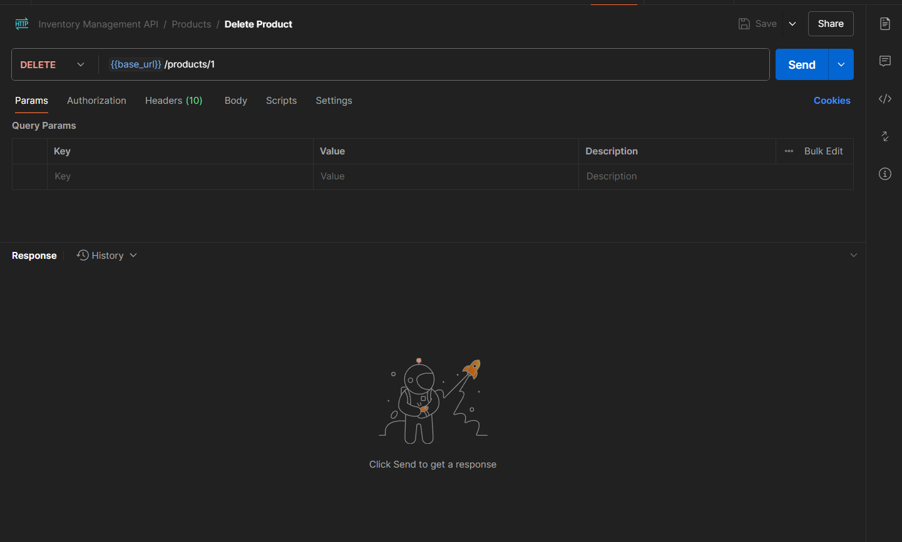

📥 [Download Postman Collection](/Inventory Management API.postman_collection.json)

---

## ⚙️ Setup Instructions
For UI please do NPM install and NPM run Build 

compresser run dev

!!!!!!!!!!!!!!!!  Enjoy   !!!!!!!!!!!!!!!!!!!!!!!


### 1. Clone the Project

```bash
git clone https://github.com/your-username/inventory-app.git
cd inventory-app
